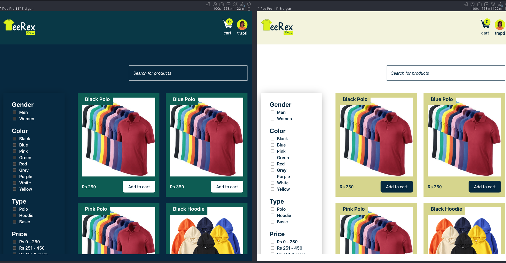

# TeeRexStore

A t-shirt shopping website. It is a sample website to showcase my skills.
The task is taken from Greektrust coding challenge. [Here](https://www.geektrust.com/coding/detailed/teerex-store) is the description of the task, rules, api, mockup etc.

## Tool and Tech

- Bundler - [Vite](https://vitejs.dev)
- UI - React + Redux + Typescript
- Lint - Eslint
- Formatter - Prettier
- Tests - [Vitest](https://vitest.dev)
- Animations - CSS and [GSAP](https://greensock.com)

## Features

- Fetch products using API.
- Client side search and filtering of products.
- Shopping cart

## Accessibility

- [Accessible colors](https://contrast-grid.eightshapes.com/?version=1.1.0&background-colors=&foreground-colors=%23FFFFFF%2C%20White%0D%0A%23042940%0D%0A%23005C53%0D%0A%239FC131%0D%0A%23DBF227%0D%0A%23D6D58E%20%0D%0A%237f0000%0D%0A%23ffcccc&es-color-form__tile-size=regular&es-color-form__show-contrast=aaa&es-color-form__show-contrast=aa&es-color-form__show-contrast=aa18&es-color-form__show-contrast=dnp)

- Light and dark mode
  
